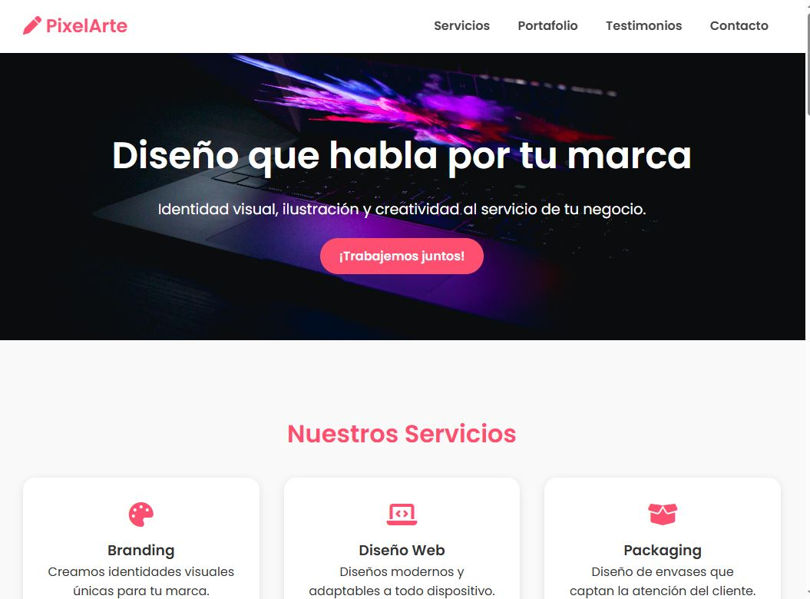

# 🎨 PixelArte | Estudio Creativo

PixelArte es un sitio web ficticio desarrollado como proyecto web front-end para presentar los servicios y el estilo visual de un estudio de diseño gráfico. Se destacan secciones como servicios, portafolio, testimonios y contacto, todo con una estética moderna y responsiva.

## 🧾 Índice

- [Demo](#demo)
- [Características](#características)
- [Tecnologías](#tecnologías)
- [Estructura del proyecto](#estructura-del-proyecto)
- [Cómo usar](#cómo-usar)
- [Capturas](#capturas)
- [Autor](#autor)

---

## 🖥️ Demo

👉 [Ver demo en vivo](https://facudee.github.io/PixelArte/)

---

## ✨ Características

- Sitio web responsivo y moderno
- Menú adaptable para dispositivos móviles
- Secciones:
  - **Hero**: bienvenida con mensaje principal
  - **Servicios**: tarjetas animadas generadas desde JavaScript
  - **Portafolio**: galería de imágenes animadas
  - **Testimonios**: citas de clientes simuladas
  - **Contacto**: formulario y mapa incrustado
- Scroll suave y botón de "volver arriba"
- Íconos sociales interactivos
- Estilos definidos con CSS puro y variables para personalización rápida

---

## 🛠️ Tecnologías

- HTML5
- CSS3 (con variables y diseño responsive)
- JavaScript (DOM dinámico)
- [Font Awesome](https://fontawesome.com/)
- Google Fonts (Poppins)
- Mapa de Google incrustado

---

## 🗂️ Estructura del proyecto

```bash
PixelArte/
├── index.html # Página principal
├── styles.css # Estilos principales del sitio
├── main.js # Lógica para inyectar servicios, testimonios, portafolio y menú
├── imgs/ # Carpeta de imágenes (incluye favicon, imágenes del hero, etc.)
└── README.md # Documentación del proyecto
```

---

## 🚀 Cómo usar

1. Cloná este repositorio:
   ```bash
   git clone https://github.com/FacuDee/PixelArte.git
   ```
2. Abrí el archivo `index.html` en tu navegador.

3. ¡Listo! Ya podés navegar por el sitio.

---

## 📸 Capturas



---

## 👤 Autor

Creado por **FacuDee**  
💼 [GitHub](https://github.com/FacuDee)  
📸 [Linkedin](https://www.linkedin.com/in/facundo-diorio-22531b32b/)  

---

## 📄 Licencia

Este proyecto es solo para fines educativos y de práctica personal.